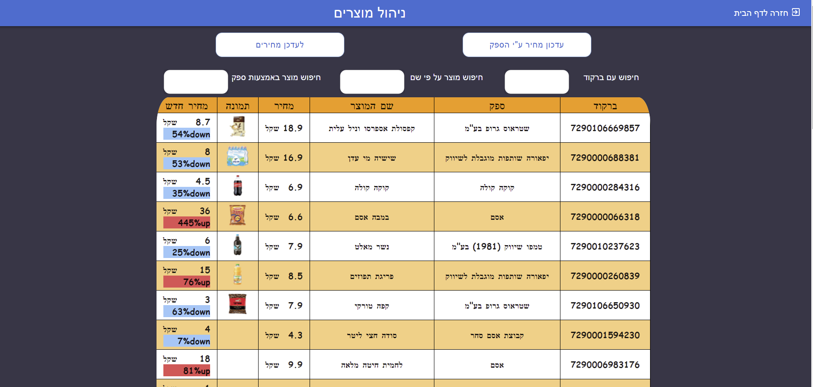

 
  
  
  
  
# Introduction: Product App

This is a web application that helps the users who owens a shop with some products to change the price and notify the customer which product has a discount.
All the information are stored in the server side that was build with express and the DB that used to store the info are MongoDB. 

## Motivation

The motivation is to build an easy-to-use product app that a basic shop owner can clearly understand how to update the items that in the shop.

## Screenshot 

## Built with

Our application was built with the below list backend packages/libraries

- Express
- Mongoose
- MongoDB
- Atlas

For the Frontend packages/libraries we used

- React
- Material UI

## Deploy

Heroku: https://mernproductapp.herokuapp.com/

## Contributors

- Philip Kouchner
 
 ## Personal Info
 - Website : http://philipkouchner.com/